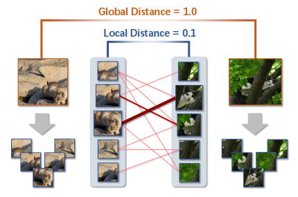
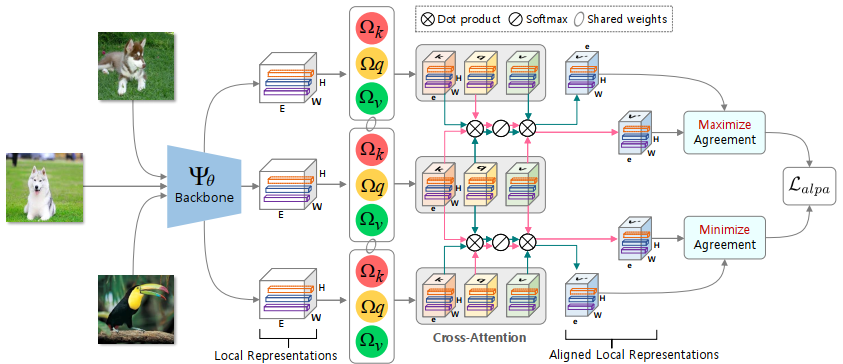
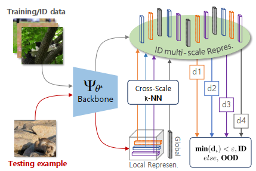
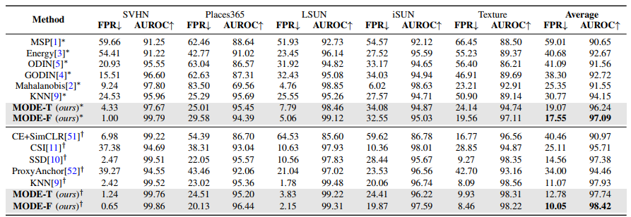
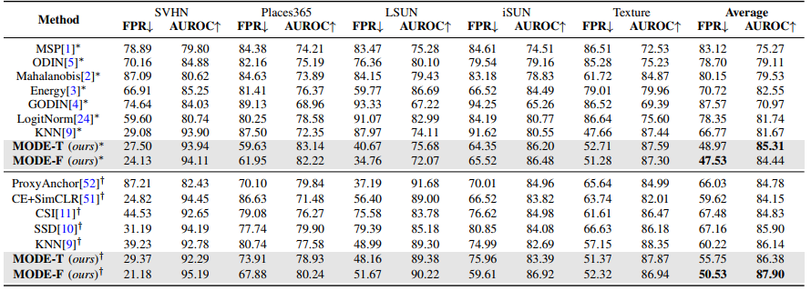
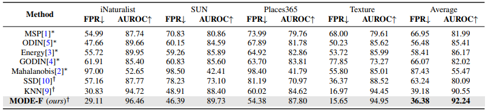
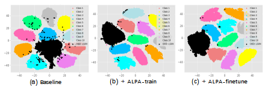
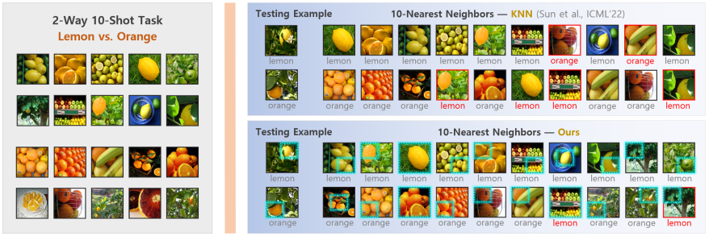

# From Global to Local: Multi-scale Out-of-distribution Detection
## Abstract
Out-of-distribution (OOD) detection aims to detect “unknown” data whose labels have not been seen during the in-distribution (ID) training process. Recent progress in representation learning gives rise to distance-based OOD detection that recognizes testing examples as ID/OOD according to their relatively distances to the training data of ID classes. Previous approaches calculate pairwise distances relying only on global image representations, which can be sub-optimal as the inevitable background clutter and intra-class variation may drive imagelevel representations from the same ID class far apart in a given representation space. In this work, we tackle this challenge by proposing Multi-scale OOD DEtection (MODE), a first framework leveraging both global visual information and local region details of images to maximally benefit OOD detection. Specifically, we first find that existing models pretrained by offthe-shelf cross-entropy or contrastive losses are incompetent to
capture valuable local representations for MODE, due to the scale-discrepancy between the ID training and OOD detection processes. To mitigate this issue and encourage locally discriminative representations in ID training, we propose Attention-based Local PropAgation (ALPA), a trainable objective that exploits a cross-attention mechanism to align and highlight the local regions of the target objects for pairwise examples. In test-time OOD detection, a Cross-Scale Decision (CSD) function is further devised on the most discriminative multi-scale representations to separate ID-OOD data more faithfully. We demonstrate the effectiveness and flexibility of MODE on several benchmarks. Remarkably, MODE outperforms the previous state-of-the-art up to 19.24% in FPR, 2.77% in AUROC. 

## Motivation 
Motivation of exploring local, region-level representations to enhance the distance calculation between pairwise examples: the inevitable background
clutter and intra-class variation may drive global, image-level representations from the same ID class far apart in a given representation space. For the
first time, we take advantage of both global visual information and local region details of images to maximally benefit OOD detection.
<p align="center">
  
</p>
 
## Overview of training-time Attention-based Local Propagation (ALPA)
During ID training, we develop ALPA, an end-to-end, plug-and-play, and cross-attention based learning objective tailored for encouraging locally discriminative representations for MODE.
<p align="center">
  
</p>

## Overview of test-time OOD detection with Cross-scale Decision (CSD) 
During test-time OOD detection, we devise CSD, a simple, effective and multi-scale representations based ID-OOD decision function for MODE.
<p align="center">
  
</p>


## Contributions
- We propose MODE, a first framework that takes advantage of multi-scale (i.e., both global and local) representations for OOD detection.

- In ID training, we develop ALPA, an end-to-end, plug-and-play, and cross-attention based learning objective tailored for encouraging locally discriminative representations for MODE.

- In test-time OOD detection, we devise CSD, a simple, effective and multi-scale representations based ID-OOD decision function for MODE.

- Extensive experiments on several benchmark datasets demonstrate the effectiveness and flexibility of MODE. Remarkably, MODE outperforms the previous state-ofthe-art up to 19.24% in FPR, 2.77% in AUROC.


## Strong Performance
- CIFAR-10 (ID) with ResNet-18
<p align="center">
  
</p>

- CIFAR-100 (ID) with ResNet-34
<p align="center">
  
</p>

- ImageNet (ID) with ResNet-50
<p align="center">
  
</p>

## Visualization
-  Visualization with tSNE
<p align="center">
  
</p>

- Visualization analysis on k-nearest neighbors
<p align="center">
  
</p>

## Dependencies
* [PyTorch](https://pytorch.org/)
* [scipy](https://github.com/scipy/scipy)
* [numpy](http://www.numpy.org/)
* [sklearn](https://scikit-learn.org/stable/)
* [faiss](https://github.com/facebookresearch/faiss)
* [pytorch-vit](https://github.com/lukemelas/PyTorch-Pretrained-ViT)
* [ylib](https://github.com/sunyiyou/ylib)

## Datasets
#### In-distribution dataset
Please download [ImageNet-1k](http://www.image-net.org/challenges/LSVRC/2012/index) and place the training data and validation data in
`./datasets/imagenet/train` and  `./datasets/imagenet/val`, respectively.

#### Out-of-distribution dataset

We have curated 4 OOD datasets from 
[iNaturalist](https://arxiv.org/pdf/1707.06642.pdf), 
[SUN](https://vision.princeton.edu/projects/2010/SUN/paper.pdf), 
[Places](http://places2.csail.mit.edu/PAMI_places.pdf), 
and [Textures](https://arxiv.org/pdf/1311.3618.pdf), 
and de-duplicated concepts overlapped with ImageNet-1k.

For iNaturalist, SUN, and Places, we have sampled 10,000 images from the selected concepts for each dataset,
which can be download via the following links:
```bash
wget http://pages.cs.wisc.edu/~huangrui/imagenet_ood_dataset/iNaturalist.tar.gz
wget http://pages.cs.wisc.edu/~huangrui/imagenet_ood_dataset/SUN.tar.gz
wget http://pages.cs.wisc.edu/~huangrui/imagenet_ood_dataset/Places.tar.gz
```

For Textures, we use the entire dataset, which can be downloaded from their
[original website](https://www.robots.ox.ac.uk/~vgg/data/dtd/).

Please put all downloaded OOD datasets into `./datasets/ood_data`.

### 2. Dataset Preparation for CIFAR Experiment 

#### In-distribution dataset

The downloading process will start immediately upon running. 

#### Out-of-distribution dataset


We provide links and instructions to download each dataset:

* [SVHN](http://ufldl.stanford.edu/housenumbers/test_32x32.mat): download it and place it in the folder of `datasets/ood_data/svhn`. Then run `python select_svhn_data.py` to generate test subset.
* [Textures](https://www.robots.ox.ac.uk/~vgg/data/dtd/download/dtd-r1.0.1.tar.gz): download it and place it in the folder of `datasets/ood_data/dtd`.
* [Places365](http://data.csail.mit.edu/places/places365/test_256.tar): download it and place it in the folder of `datasets/ood_data/places365/test_subset`. We randomly sample 10,000 images from the original test dataset. 
* [LSUN](https://www.dropbox.com/s/fhtsw1m3qxlwj6h/LSUN.tar.gz): download it and place it in the folder of `datasets/ood_data/LSUN`.
* [iSUN](https://www.dropbox.com/s/ssz7qxfqae0cca5/iSUN.tar.gz): download it and place it in the folder of `datasets/ood_data/iSUN`.
* [LSUN_fix](https://drive.google.com/file/d/1KVWj9xpHfVwGcErH5huVujk9snhEGOxE/view?usp=sharing): download it and place it in the folder of `datasets/ood_data/LSUN_fix`.
* [ImageNet_fix](https://drive.google.com/file/d/1sO_-noq10mmziB1ECDyNhD5T4u5otyKA/view?usp=sharing): download it and place it in the folder of `datasets/ood_data/ImageNet_fix`.
* [ImageNet_resize](https://www.dropbox.com/s/kp3my3412u5k9rl/Imagenet_resize.tar.gz): download it and place it in the folder of `datasets/ood_data/Imagenet_resize`.

[//]: # (For example, run the following commands in the **root** directory to download **LSUN**:)

[//]: # (```)

[//]: # (cd datasets/ood_datasets)

[//]: # (wget https://www.dropbox.com/s/fhtsw1m3qxlwj6h/LSUN.tar.gz)

[//]: # (tar -xvzf LSUN.tar.gz)

[//]: # (```)

## ID training w/ or w/o ALPA
**Baseline**
```
python ./ALPA/main_supcon.py --batch_size 512 \
  --learning_rate 0.5 \
  --temp 0.1 \
  --cosine
```

**ID training w/ ALPA-train**
```
python ./ALPA/main_supcon.py --batch_size 128 \
--learning_rate 0.5 \
--temp 0.1 \
--cosine \
--trial 0 \
--dataset cifar100 \
--model resnet34 \
--alpa_train
```

**ID training w/ ALPA-finetune**
```
python ./ALPA/main_supcon.py --batch_size 128 \
--learning_rate 0.1 \
--temp 0.1 \
--cosine \
--trial 0 \
--dataset cifar100 \
--model resnet34 \
--alpa_finetune
```

## Test-time OOD detection with CSD
Specify the path to the pretrained model, and execute the following command.
```
Run ./demo_cifar.sh.
```

## References
<div style="text-align:justify; font-size:80%">
    <p>
        [1] Khosla P, Teterwak P, Wang C, Sarna A, Tian Y, Isola P, Maschinot A, Liu C, Krishnan D; <a href="https://proceedings.neurips.cc/paper/2020/hash/d89a66c7c80a29b1bdbab0f2a1a94af8-Abstract.html">Supervised Contrastive Learning (SupCon)</a>; NeurIPS 2020.
    </p>
    <p>
        [2] Sun, Yiyou and Ming, Yifei and Zhu, Xiaojin and Li, Yixuan; <a href="https://proceedings.mlr.press/v162/sun22d.html">Out-of-distribution Detection with Deep Nearest Neighbors (KNN)</a>; ICML 2022.
    </p>
</div>


## Acknowledge
Our codes (as well as this README.md) are based on the public repositories of [SupCon](https://github.com/HobbitLong/SupContrast) and [KNN](https://github.com/deeplearning-wisc/knn-ood).

We thank authors of  for their source code.  

